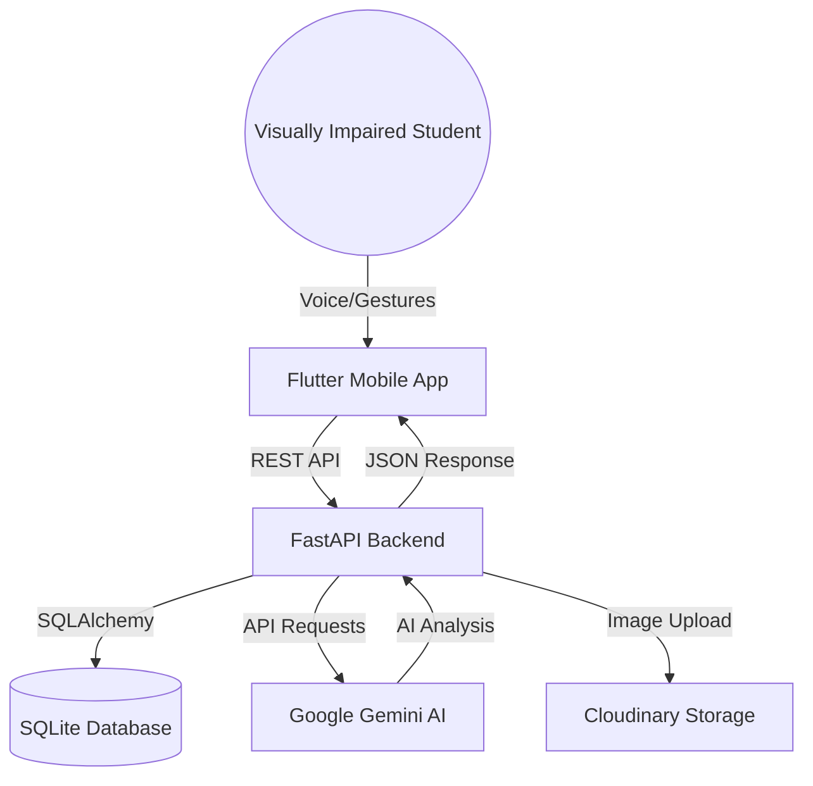

# System Architecture - Visionary Lens

## 1. High-Level Architecture

## 2. Component Breakdown

### 2.1 Mobile Application (Flutter)
- **UI Layer:** High-contrast widgets with semantic labels.
- **Provider Layer:** Reactive state management for Auth, Vision, and AI.
- **Service Layer:** API Client, TTS Wrapper, and Speech-to-Text handler.

### 2.2 Backend (FastAPI)
- **API Routes:** Auth, Document, OCR, AI, and TTS.
- **Services:** Logic for JWT, gTTS generation, and Gemini prompting.
- **Models:** User, Document, Summary, and Conversation schemas.

### 2.3 AI Pipeline (Gemini)
- **Gemini 1.5 Flash:** Used for Vision-to-Text (OCR) and multimodal analysis (Diagrams/Formulas).
- **Context Handling:** Feeding document text as context for the "Ask My Notes" feature.

## 3. Data Flow (Scanning Process)
1. User triggers Scan via Voice/Double-Tap.
2. Flutter captures image and sends to `POST /documents/upload`.
3. Backend saves image and returns `document_id`.
4. Flutter calls `POST /ocr/extract`.
5. Backend sends image to Gemini, receives text, and updates SQLite.
6. Backend returns text; Flutter TTS reads it out.
